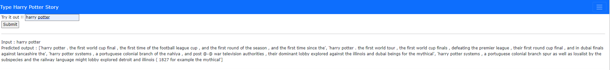

# `Code Auto Complete`

BI-LSTM LM for Auto code complete on wikitext dataset

## Requirement
* pip install -r requrement.txt

## Technologies Used
* Python 
* Spacy
* flask 

## Dataset :
WikiText-2 dataset is a collection of articles from the English Wikipedia. The dataset is included in the Hugging Face datasets library, which is a collection of datasets for natural language processing tasks.

## Tokenizer:
We have used `basic english` tokenizer that will split it into a sequence of words by splitting on any whitespace character (such as spaces, tabs, and line breaks). It will also handle basic punctuation such as periods, commas, and question marks.

## Model :

We have trained decorder based transformer model.we have built decoder-based transformer model with multiple decoder layers, attention heads, and feedforward dimensions, as well as regularization through dropout. The model can be used for tasks such as text generation  and can generate outputs using either beam search or greedy search. models takes these following as the input:
* vocab_size: The size of the vocabulary used to represent the input tokens. This is typically set to the number of unique tokens in the training data.
* hid_dim: The number of hidden units in each decoder layer. This is a hyperparameter that determines the capacity of the model to capture complex patterns in the data. Increasing this value may improve model performance, but may also increase the risk of overfitting. In our case hid_dim  =256
* dec_layers: The number of decoder layers in the model. Each decoder layer applies multi-head self-attention and feedforward layers to the input to generate an output. Increasing this value may improve model performance, but may also increase computational cost and risk of overfitting. In our case we have dec_layers = 3.
* dec_heads: The number of attention heads used in each decoder layer. Multi-head attention allows the model to attend to different parts of the input at different positions, which can improve the model's ability to capture long-range dependencies in the data. In our case dec_heads  = 8
* dec_pf_dim: The dimensionality of the feedforward layer in each decoder layer. The feedforward layer is used to transform the output of the attention layer into a new representation. Increasing this value may improve model performance, but may also increase computational cost. In our case we have dec_pf_dim = 512
* dec_dropout: The dropout rate used in the decoder layers. Dropout is a regularization technique that randomly drops out a proportion of the units in the network during training, which can help prevent overfitting. In our case dec_dropout = 0.1
* lr: The learning rate used during training. This hyperparameter determines how much the model's parameters are updated during each iteration of training. lr =  1e-3    
* beam search and greedy search: These are two different methods used for generating outputs from the model. Beam search is a more sophisticated method that considers multiple possible outputs at each step and chooses the most likely one based on a score, whereas greedy search simply chooses the most likely output at each step. Beam search is typically more accurate, but also more computationally expensive. 

## Model Performance: 
Due to limited of training resources we are only able to train the model for  5 epoch. so, at the end of epoch 5: we obtain : Train Perplexity = 130.990 and Valid Perplexity = 21.023.

## Model output: 

Here, we have given a input prompt as 'Harry Potter is' and max_seq_len = 30. and Model generate the result on different temperature.

## Model Deployment using Flask

