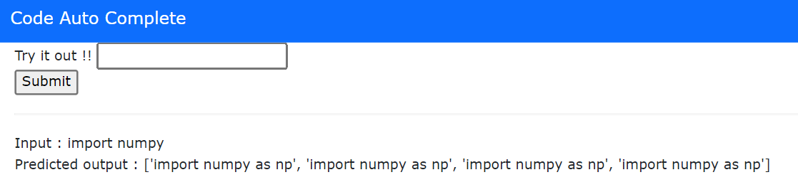
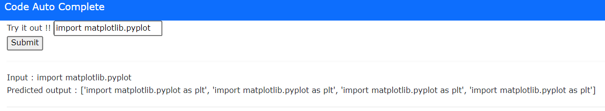

# `Code Auto Complete`

BI-LSTM LM for Auto code complete on codeparrot/github-jupyter-code-to-text dataset

## Requirement
* Download NodeJs from 
* pip install -r requrement.txt

## Technologies Used
* Python 
* Spacy
* flask 

## Features 
some of the screenshot of my frontend looks like :

# Special Thanks 
Thank you to Todsavad Tangtortan for helping in (frontend) of the website.