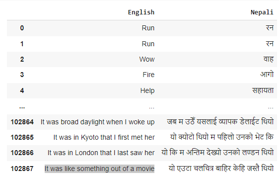
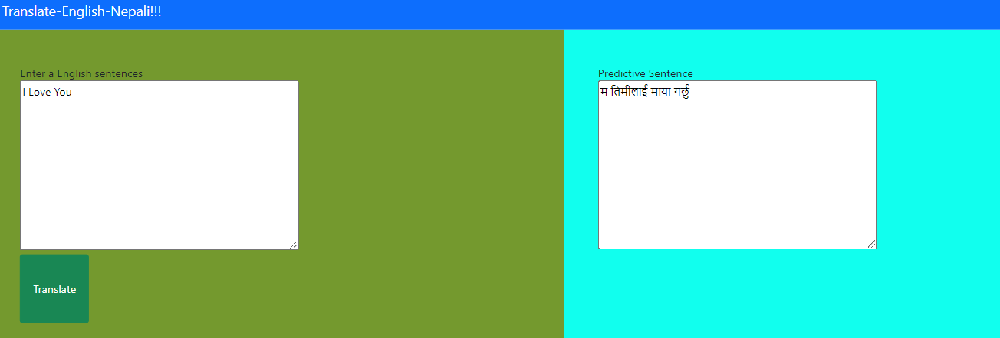
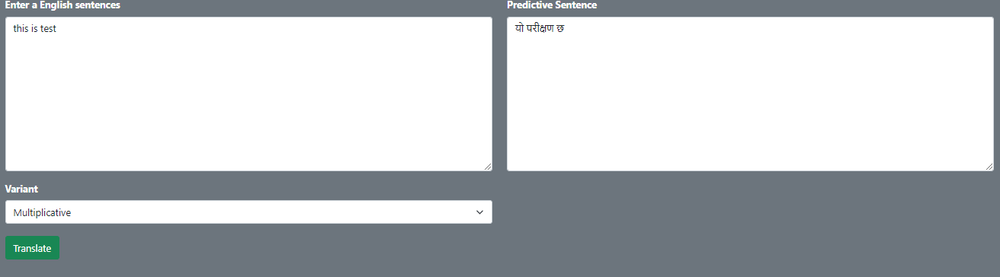
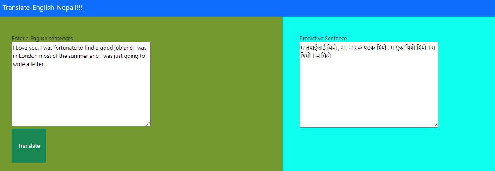

# `English-Nepali Convertor`

Encoder-Decoder Attention based LSTM LM for English to Nepali  Translation on English-Nepali dataset.

### Dataset Source:
https://github.com/sushil79g/Nepali_nlp/tree/master/Nepali_nlp/local_dataset/tranlation.xlsx

## Requirement
* pip install -r requrement.txt

## Technologies Used
* Python 
* Attacut
* flask 

## Dataset Sample

## Features 
some of the screenshot of my frontend:

