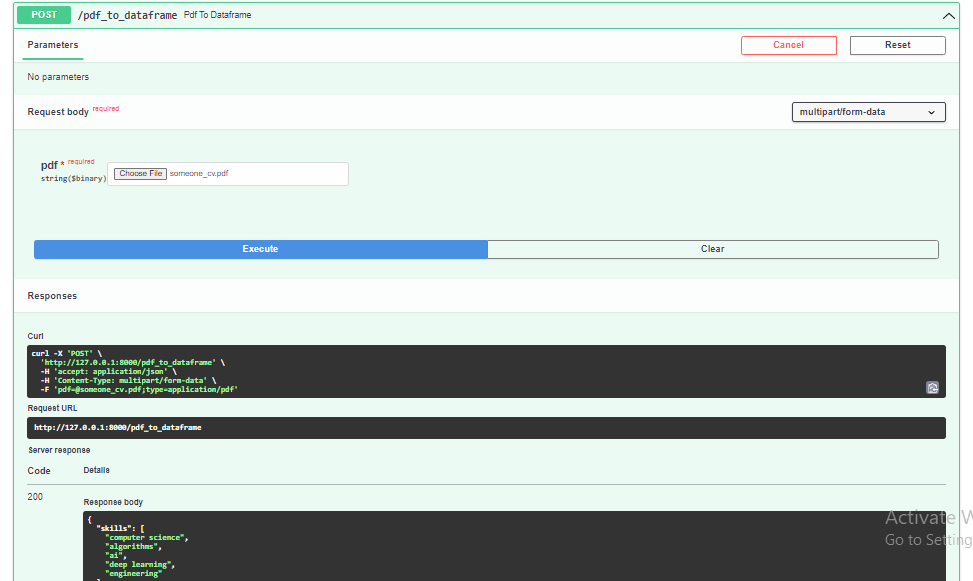
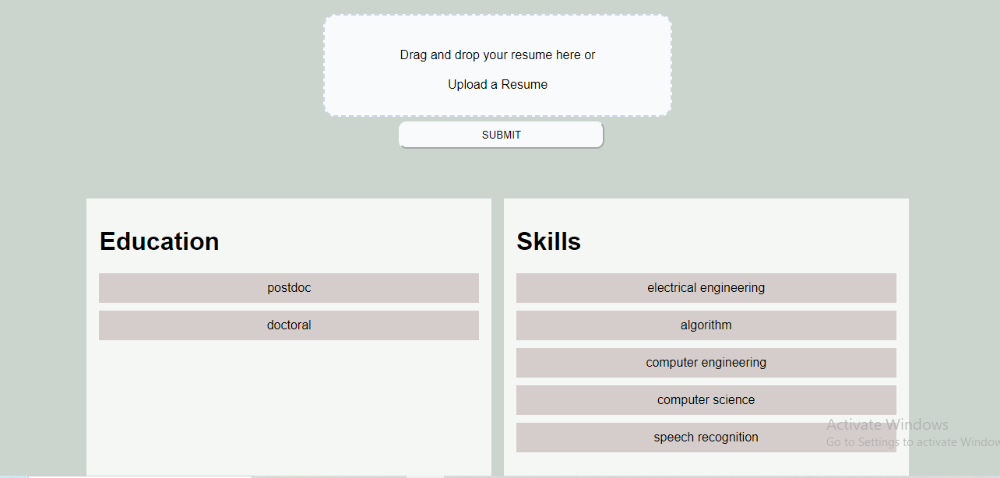

# `PDF Resume Extractor`
A web application that extracts information from PDF resumes like Education , Skills etc., performs Named Entity Recognition to identify entities and extract the information in Tablular form.

## Requirement
* Download NodeJs from 
* pip install -r requrement.txt
* start 2 terminal and type 2 command
* cd frontend/npm start
*  python3 -m uvicorn app:app --reload

## Technologies Used
* Python 
* Spacy
* PyPDF2  
* FASTAPI 
* ReactJS 
* Named Entity Recognition(NER)

## Features 
* FastAPI is a modern, high-performance web framework for building APIs with Python based on standard type hints. It has the following key features: Fast to run: It offers very high performance, on par with NodeJS and Go, thanks to Starlette and pydantic. 
 

* React is an open-source technology that combines JavaScript and HyperText Markup Language (HTML) to display small pieces of the large UI. This is how my frontend looks like:

# Special Thanks 
Thank you to Ms.Sandhya Lamichhane (https://github.com/creatorof) for helping in ReactJs (frontend) of the website.

