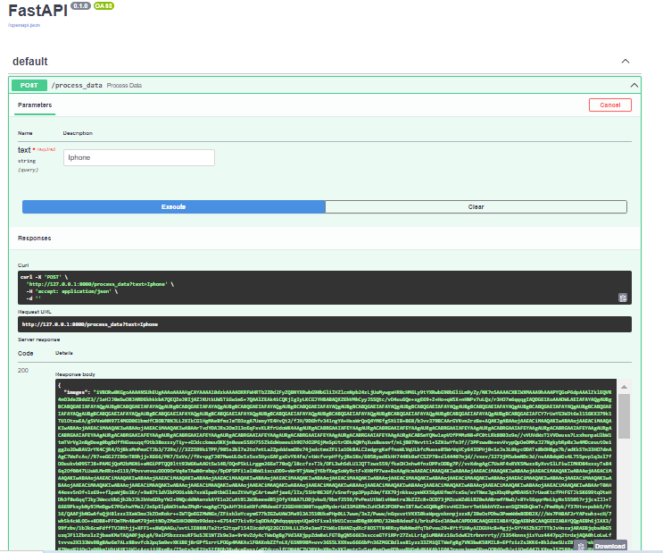
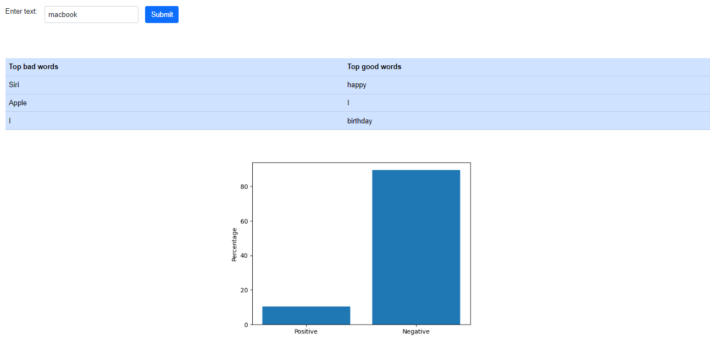

# `Sentiment Analysis on Treebank Dataset`
BI-LSTM sentiment classification on Standford Sentiment Treebank dataset
To scrap twitter post by keyword, I used twint library.

## Requirement
* Download NodeJs from 
* pip install -r requrement.txt
* To download twint simply install - pip3 install twint
* pip3 install --user --upgrade git+https://github.com/twintproject/twint.git@origin/master#egg=twint

## Technologies Used
* Python 
* Spacy
* twint 
* FASTAPI 
* ReactJS 
* pytreebank

## Features 
* Twint is a Python package that provides an easy-to-use interface to Twitter data. It allows you to scrape Twitter data without using Twitter's official API, which can be useful in cases where API access is limited or when you want to access historical data that is not available through the API.
* FastAPI is a modern, high-performance web framework for building APIs with Python based on standard type hints. It has the following key features: Fast to run: It offers very high performance, on par with NodeJS and Go, thanks to Starlette and pydantic. 
 

* React is an open-source technology that combines JavaScript and HyperText Markup Language (HTML) to display small pieces of the large UI. This is how my frontend looks like:

# Special Thanks 
Thank you to Ms.Sandhya Lamichhane (https://github.com/creatorof) for helping in ReactJs (frontend) of the website.

