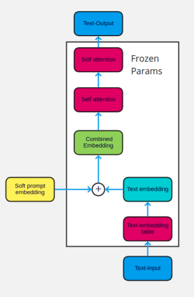

# `Soft Prompt Guided Abstractive Summarization`

GPT-2 and T-5 for Generating Abstractive summary

## Objective :
    Soft prompt-based approach for abstractive summarization using extractive summary as input.

## Requirement
* pip install -r requrement.txt

## Technologies Used
* Python 
* PyTorch
* Django

## Model 

* Prompt tuning :
    Prompt tuning with soft prompt technique that involves fine-tuning language models, such as GPT-2 and T-5. Here, the pretrained model parameters are frozon or kept-fixed while others are updated druing training with new data.  This approach are mainly used in conjunction with prompt tuning to fine-tune specific part of the model for specific taks while maintaining the pre-trained knowledge of the rest of the model. 
    

    Frozen parameter prompt tuning can be especially useful when the task-specific data is limited, or when fine-tuning the entire model with new data may result in overfitting. By freezing some of the parameters in the model, the model can retain its pre-trained knowledge and continue to perform well on tasks that require the use of this knowledge.

* GPT-2 :
    Prompt tuning technique we have used in our approach is for fine-tuning the GPT-2 model for text summarization text by providing it with a prompts that guide its generation of summaries. The prompt like Top-20 important keywords from each sample or Top-k important sentences from each sample or 100-1 prompt that are relevant to the content to be summarized.
    Prompt tuning on GPT-2 for summarization tasks can also be performed with small amounts of additional training data, making it a cost-effective way to fine-tune language model for specific tasks. We belive that getting a right prompt with a appropriate amount of few-shot can add valuable improvement on summarization tasks.

* T5- small :
    Prompt tuning on T5-model for summarization task involves fine-tuning the T-5 small language model for summarizing text. for summarizing the text we are providing a prompts that guide the model for generation of summaries, similar to prompt-tuning on GPT-2.
    Prompt tuning on T5 model for summarization also involves small amount of additional training data, making it a cost-effective way to fine-tune language model for specific tasks. One of the advantages of using T5- model is that it has ability to generate both abstractive and extractive summaries. We belive that getting a right prompt with a approapriate amount of few-shot can improve the accuracy and efficienty of summarization models and we can get better summary.